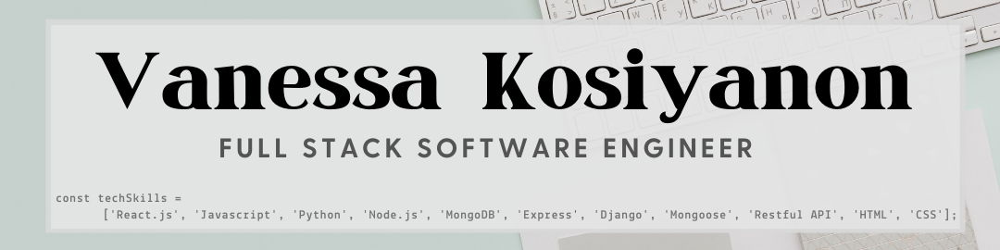

<!--
**vkosiyan/vkosiyan** is a ✨ _special_ ✨ repository because its `README.md` (this file) appears on your GitHub profile.

Here are some ideas to get you started:

- 🔭 I’m currently working on ...
- 🌱 I’m currently learning ...
- 👯 I’m looking to collaborate on ...
- 🤔 I’m looking for help with ...
- 💬 Ask me about ...
- 📫 How to reach me: ...
- 😄 Pronouns: ...
- ⚡ Fun fact: ...
-->

### Hi, and welcome! 👋

I'm a full stack web developer with a background in Human Resources, E-commerce, and Product Development. I recently completed a full-time software immersive bootcamp with General Assembly, which included over 450 hrs of professional training over the course of twelve weeks. I have a passion for learning and innovation, and am excited for the opportunity to contribute my skills in a meaningful manner!

**🌱 I'm currently learning** Java through Codeacademy.

**I'm currently working on** a React.js app that has similar functionality to Goodreads.com.

**In my free time you can** find me playing videogames (currently on a Hearthstone kick), or watching a DIY tutorial on YouTube.

## Connect with Me:
<!-- 
* [My Portfolio](https://vanessa-kosiyanon.com) -->
* [LinkedIn](https://linkedin.com/in/vkosiyan)
