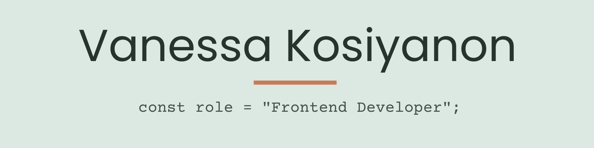

<!--
**vkosiyan/vkosiyan** is a ✨ _special_ ✨ repository because its `README.md` (this file) appears on your GitHub profile.

Here are some ideas to get you started:

- 🔭 I’m currently working on ...
- 🌱 I’m currently learning ...
- 👯 I’m looking to collaborate on ...
- 🤔 I’m looking for help with ...
- 💬 Ask me about ...
- 📫 How to reach me: ...
- 😄 Pronouns: ...
- ⚡ Fun fact: ...
-->
# Hi, I'm Vanessa 👋☕

Frontend developer based in Irvine, CA. For 5+ years I built internal React tools for film production teams at Lightstorm Entertainment (the *Avatar* films), including searchable data pages, real-time collaboration features, and reusable UI components.

I taught myself HTML and CSS in junior high to build websites as a hobby, and I've been building for the web ever since.

## Tech
**Frontend:** React, JavaScript, HTML, CSS/SCSS, Styled Components, React Hooks 
**Backend & APIs:** Node.js, Express, MongoDB, PostgreSQL, Django, REST APIs, WebSockets 
**Tools:** Git, GitHub, GitLab, AWS S3

## Projects
- **[Bookish](link)**: book search app using the Google Books and NYT Best Sellers APIs
- **[You Should Try](link)**: TV-show recommender with Google OAuth
- **[Goal Tracker](link)**: Django/PostgreSQL goal and bucket-list app

## Currently
Sharpening my skills by building a TypeScript + React deliveries tracker with tests. *(Only keep this line once you've started it.)*

📫 [LinkedIn](https://linkedin.com/in/vkosiyan)
